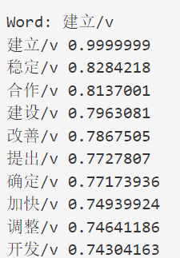

# 第二次大作业- FNN, RNN, LSTM词向量对比分析

## 实验任务

在北京大学标注的《人民日报》1998年1月份的分词语料库上，分别训练FNN, RNN, LSTM三种模型，提取各自学习
到的词向量查找表，对比分析这三种模型生成的词向量的差异性。

1. 获得汉语或英语词语的词向量.
2. 在任务1的基础上，随机选择20个单词，计算与其词向量最相似 的前10个单词。
3. 对于同一批词汇，对比分别用FNN, RNN 或 LSTM获得的词向量的差异数据预处理

## 实验背景

在自然语言处理任务中，一个重要的环节是需要考虑如何将文本转换为可计算的形式,也就是将其转换为向量。通常，有两种表示方式：**离散表示**和**分布式表示**

### 离散表示

传统的基于规则或基于统计的自然语义处理方法将单词看作一个原子符号,例如使用独热码进行编码。独热码把每个词表示为一个长向量。这个向量的维度是词表大小，向量中只有一个维度的值为1，其余维度为0，这个维度就代表了当前的词。

独热码相当于给每个词分配一个id，这就导致这种表示方式不能展示词与词之间的关系。另外，独热码将会导致特征空间非常大，但也带来一个好处，就是在高维空间中，很多应用任务线性可分。通常而言,独热码一般是用来做查找表的索引,不会直接用来表示一个单词.

### 分布式表示

文本嵌入指的是将词转化成一种分布式表示，又称词向量。分布式表示就是将词表示成一个定长的连续的稠密向量。

分布式表示优点:

* **词之间存在相似关系**：
  是词之间存在“距离”概念，这对很多自然语言处理的任务非常有帮助。
* **包含更多信息**：
  词向量能够包含更多信息，并且每一维都有特定的含义。

生成词向量的方法有很多，但其基本思想都是: **任一词的含义可以用它的周边词来表示**。

## 词向量获取

生成词向量的方式可分为：基于**统计的方法**和基于**语言模型的方法**。

这次任务中,我们主要使用后者来获得词向量:

语言模型生成词向量是通过训练神经网络语言模型NNLM（neural network language model），词向量做为语言模型的附带产出。NNLM背后的基本思想是对出现在上下文环境里的词进行预测，这种对上下文环境的预测本质上也是一种对共现统计特征的学习。

较著名的采用NNLM生成词向量的方法有：Skip-gram、CBOW、LBL、NNLM、C&W、GloVe等。各类模型中生成的向量效果差距不大（生成向量的效果更取决于良好的训练数据）。

### CBOW模型的原理:

CBOW模型是**预测上下文已知的情况下，当前词出现的概率**。上下文的选取采用窗口方式，即只将当前词窗口范围内的词作为上下文。中心词概率公式如下：

$$
P(w_t|w_{t-k},w_{t-(k-1)}…,w_{t-1},w_{t+1},w_{t+2}…,w_{t+k})= P(w_t|context)
$$

### Skip-gram模型的原理:

Skip-gram算法就是**在给出目标单词（中心单词）的情况下，预测它的上下文单词**（除中心单词外窗口内的其他单词）。上下文一定窗口内的单词叫做context words，窗口是指window size，也就是指定一个window size的值，所要预测的词语就是和中心词距离在window size内的所有其他词。

在本次实验中,我所采纳的基本思想就是给定单词表示,预测上下文来获取词向量,也就是基于Skip-gram的思想.

## 数据预处理

数据预处理的部分在 ``dataset.py``文件下.我们的任务是提取各自基本模型学习到的词向量查找表，然后对比分析这三种模型生成的词向量的差异性。

### 获取词表

那么我们首先需要确定词表范围:

通过对预料库中出现的词汇进行了统计，并按词频从高到低排序，得到了词频统计文件word_counts.txt。按照作业建议,为了减少词表参数,需要将词表范围限制在最常见的前1024个词。这即超参数中的vocab_size一项。

### 制作数据集

FNN模型和RNN/LSTM模型的输入输出不同，应使用不同的数据集。data_n_gram.pkl 和data_rnn.pkl 分别供FNN和RNN/LSTM使用。

- data_n_gram.pkl 的输入值为一个长为 n-1 的序列，标签值为这个序列的下一个值。
- data_rnn.pkl 的输入值也是一个长为 n-1 的序列。它的标签值是一个与输入值相错一位的序列，长度同样是 n-1 。
  按4:1的比例将原始[x,y]对在随机打乱后切分为训练集与测试集。

## 模型实现:

使用的三个基本模型都会具有以下的结构:

- 输入数据会首先经过一层嵌入层，将输入的 n-1 个词汇序号转换为 n-1 个 embedding_dim 维的词向量。
- 这些向量在层归一化后，被压平成一个长为 input_size的向量。(对于FNN是embedding_dim*(n-1),对于RNN/LSTM则是embedding_dim)
- 这个向量被送往一个隐藏层大小为hidden_size 的两层网络，输出一个和词向量同维的向量，作为分类的依据。(对于FNN第一层为线性层,对于RNN/LSTM则分别为RNN和LSTM模型,第二层均为线性层)
- 这个输出的词向量会和嵌入层中的词汇表进行点乘，以计算与各词汇余弦距离，并依此分类。
- pytorch的交叉熵损失函数中自带了Softmax层，不需要额外引入该层。

我们训练得到的词向量其实就是各模型中的嵌入层向量，因此我们只需要利用查找表的键（也就是词的索引表示）来取得嵌入矩阵对应的向量就可以得到该词对应的词向量。衡量两个词向量是否相似的方式也很简单，只需要分别计算lookup_table中的每个向量和word_vec的欧几里得范数（即向量的长度）。将点积除以两个向量的范数，就得到了余弦相似度。在词向量表示中，**我们忽略向量的长度，只关注向量的方向。**

## 实验结果:

三个模型均以1e-3的learning_rate和512的batch_size，并使用Adam优化器与交叉熵损失，在数据集上训练了共60个epoch。得到的结果如下：
### fnn训练结果：


fnn经过60个epoch， loss接近3.5，正确率也是近0.39，我们对该模型随机选取多个单词来进行测试，可以看到结果如下：


### rnn训练结果：


rnn经过60个epoch， loss接近3.5，正确率超过0.39，效果比fnn更好，这符合我们的预期。我们对该模型随机选取多个单词来进行测试，可以看到结果如下：


### lstm训练结果：


lstm经过60个epoch， loss低于3.5，正确率超过0.4，效果比fnn和rnn都要好，这符也符合我们的预期，lstm的建模能力确实优于前两者。我们同样对该模型随机选取多个单词来进行测试，可以看到结果如下：





可以看到，上述三种模型都能够在一定程度上，找到了与特定词语义接近的词汇，这能够说明它们学到了一种良好的词向量表示。那么如何衡量三种模型的差异和效果如何呢？最简单的方法就是对它们测试同一种词的结果，什么词更容易体现出差异呢，显然是在语料库中出现频率较高的词汇，比如说数字就很容易比较出差异。因此用数字来进行测试（例如说5/m），可以看到最终结果如下：
FNN:


RNN:


LSTM:


可以看到，三个模型都给出了数字或数量描述性词的结果.通过对结果的观察，我们不难发现，LSTM模型匹配了更多的相关词元，对于LSTM及RNN，模型甚至一定程度上学到了该数字对应数值的语义信息——与之相似度越高的词具有越接近的数值！
## 代码运行和测试：
### 文件结构  
homework2   
├── checkpoint #模型训练中间过程参数 
├── Gen  
│   ├── dataset.pkl                     #生成的数据集  
│   ├── word_count.txt                  #生成的语料计数文件  
│   ├── RNN_predictions.txt             #RNN模型预测结果（随机20个）  
│   ├── LSTM_predictions.txt  
│   └── FNN_predictions.txt   
├── PKU_TXT        
│   └── ChineseCorpus199801.TXT  #语料库文件  
├── pics   #各类结果图片  
│   └── ...  
├── config   #模型配置文件   
│   └── base.yml    
├── train_info  
│   ├── loss_info_RNN.txt  #模型训练过程中的结果  
│   ├── loss_info_LSTM.txt    
│   └── loss_info_FNN  
├── dataset.py  #数据集构建  
├── main.py  #主程序，训练或评估  
├── evaluate.py   #测评用的函数  
├── loss_analysis.py  #训练损失分析文件  
├── NN.py         # 模型源代码  
└── readme.md  # 报告和使用方法  

### 运行说明：

我在main.py文件中定义了一些了命令行参数，可以用来控制程序行为：
```Python
parser.add_argument('--model', type=str, default='LSTM',
                    help='model type: LSTM,RNN,FNN.')
parser.add_argument("--config", type=str, default="base.yaml")
parser.add_argument('--device', default='cuda:0', help='Device for Attack')
parser.add_argument('--is_train', type=bool, default=False)
parser.add_argument('--is_eval', type=bool, default=True)
args = parser.parse_args()
```
首先model参数决定使用的模型种类，config参数指明使用的配置文件类型，默认是base.yml，device参数决定使用的设备，如果机器带有GPU则使用cuda进行训练。is_train参数决定是否要进行训练，默认是进行训练。is_eval决定是否进行评估，如果进行评估则会默认用checkpoint文件中的最新模型参数来进行评估。

例如对LSTM模型进行训练和评估，则输入的命令即为：

    python main.py LSTM base.yml cuda:0 True True
训练过程中会自动将模型参数保存在checkpoint中，之后评估就不需要再次训练了。

### 配置文件

配置文件使用的是标准的yaml格式文件，这样可以方便利用python的yaml库进行解析和配置。
```Yaml
train:
  epochs: 60
  batch_size: 512 
  lr: 1.0e-3

lstm:
  vocab_size : 1024
  embedding_dim : 16
  n : 9
  input_size : 16
  hidden_size : 64
  dataset : "nn"

rnn:
  vocab_size : 1024
  embedding_dim : 16
  n : 9
  input_size : 16
  hidden_size : 64
  dataset : "nn"

fnn:
  vocab_size : 1024
  embedding_dim : 16
  n : 9
  input_size : 128
  hidden_size : 64
  dataset : "n-gram"

```
通过更改具体模型的参数就可以调整使用的模型，其中n表示使用n元文法模型中n的大小，vocab_size表示的使用词汇表的大小。dataset则是指定使用的数据集类型。

## 参考内容及附录
主要参考[Github](https://github.com/EricJin2002/UCAS-NLP-2023)

其他测试结果见Gen文件夹下的各txt文件。

