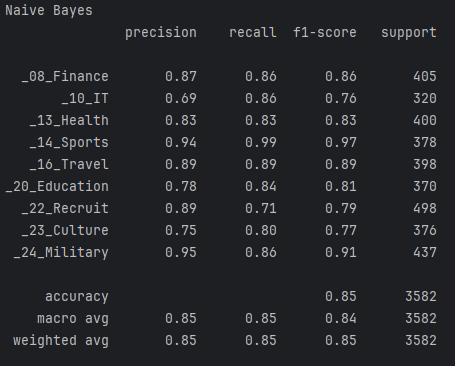
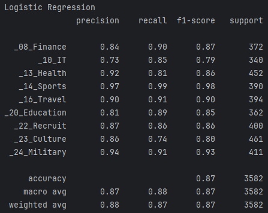
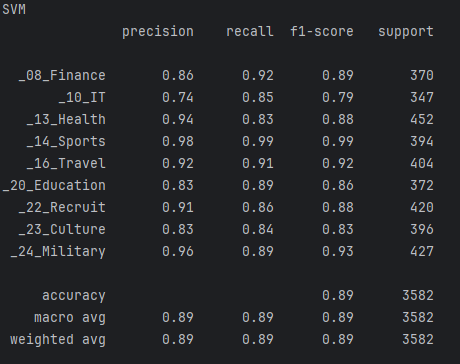
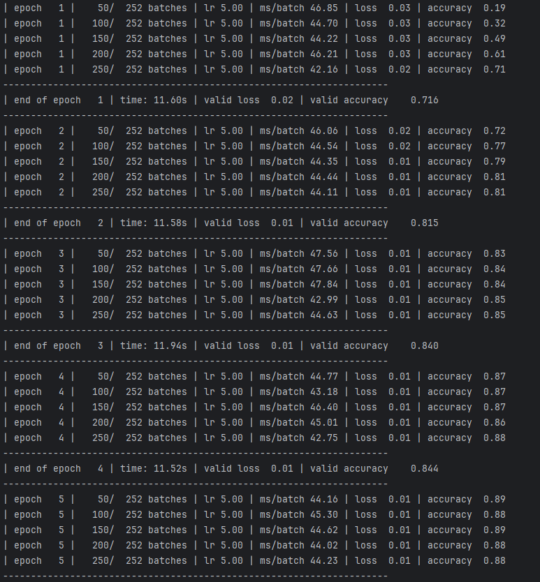
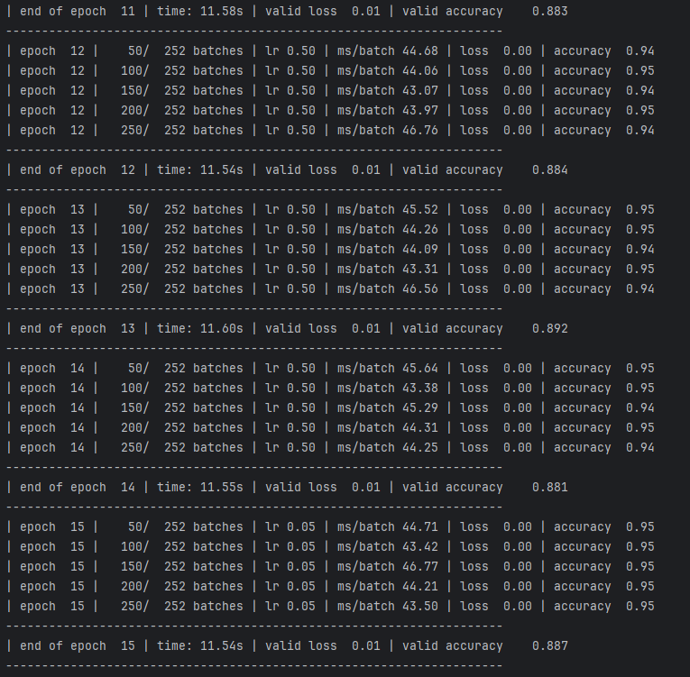
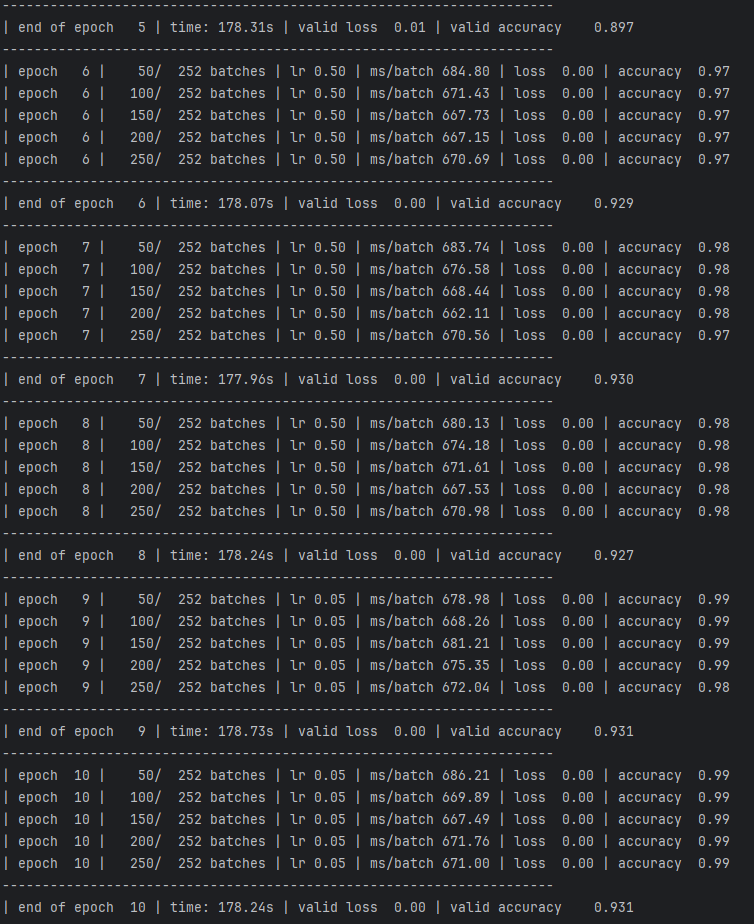
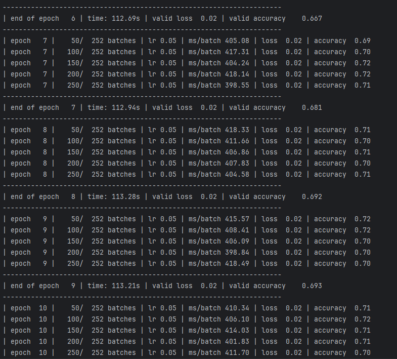

# 文本分类（Text Classification）
## 题目描述
请从新浪或其他门户网上收集一定规模的不同类别文档，进行分类整理，利用不同的特征和不同的分类器实现文本内容分类，并对不 同的方法进行对比实验。
## 背景介绍
文本分类是自然语言处理中的一个重要应用技术，根据文档的内容或主题，自动识别文档所属的预先定义的类别标签。文本分类是很多应用场景的基础，比如垃圾邮件识别，舆情分析，情感识别，新闻自动分类，智能客服机器人的知识库分类等等。本文用标注好的搜狗新闻语料，基于scikit-learn机器学习Python库，将文本分类的完整过程实现一遍。之后再使用深度学习方法来进行文本分类。
### 传统机器学习方法
在进行文本分类时，传统的机器学习方法已经被广泛应用。这些方法通常涉及文本预处理、特征提取和分类器训练。以下是一些常见的传统机器学习方法：
1. **文本预处理**  
在进行文本分类之前，文本预处理是一个重要的步骤，通常包括以下步骤：

- 分词：将文本拆分为单词或子词。
- 去除停用词：移除常见但对分类任务无用的词（如"the", "is", "and"等）。
- 词干提取和词形还原：将单词转换为它们的词干形式（如"running"变为"run"）。
2. **特征提取**  
在文本预处理之后，需要将文本转换为数值特征表示。常见的方法有：

- Bag of Words (BoW)：将每个文档表示为词汇表中每个词的频率。
- TF-IDF (Term Frequency-Inverse Document Frequency)：计算词频和逆文档频率的乘积，减少常见词的权重，增加稀有词的权重。
- 词向量（Word Embeddings）：使用预训练的词向量（如Word2Vec、GloVe）或通过训练数据生成词向量，将单词映射到低维向量空间中。
3. **分类方法**
- 朴素贝叶斯 (Naive Bayes)：一种基于贝叶斯定理的概率分类方法，适用于高维数据的分类。
- 决策树和随机森林 (Decision Trees and Random Forests)：基于树结构的分类方法。
- k近邻算法 (k-Nearest Neighbors, k-NN)：基于距离度量的分类方法。
- 逻辑回归 (Logistic Regression)：一种广义线性模型，适用于二分类任务。

### 深度学习方法
传统机器学习方法将文本分词之后，采用了TF-IDF等特征提取方式对文本进行向量化表示，所产生的文本表示矩阵是一个稀疏矩阵，而深度学习方法采用的词向量一般是一个稠密向量，可以理解为将文本的语义抽象信息嵌入到了一个具体的多维空间中，词之间语义关系可以用向量空间中的范数计算来表示。特别是当数据量较大时，深度学习方法在文本分类任务中表现出色。

1. 词嵌入模型能够将单词映射到低维向量空间中的技术。包括：
- Word2Vec：通过无监督学习，将单词映射到低维向量空间。
- GloVe (Global Vectors for Word Representation)：基于全局词共现矩阵生成词向量。
- FastText：扩展了Word2Vec，能够处理未登录词。
2. 循环神经网络（RNN, Recurrent Neural Networks）
- RNN适用于处理序列数据，能够捕捉序列中的时序信息。

- LSTM (Long Short-Term Memory)：一种特殊的RNN，能够更好地捕捉长距离依赖关系，解决了RNN的梯度消失问题。
- GRU (Gated Recurrent Unit)：一种简化的LSTM，计算效率更高。
3. 卷积神经网络（CNN, Convolutional Neural Networks）
- CNN最初用于图像处理，但也能在文本分类中取得良好效果。通过卷积操作，可以提取文本中的局部特征。

- TextCNN：使用一维卷积核对文本序列进行卷积操作，从而提取特征。
6. 预训练语言模型
预训练语言模型通过在大规模语料上进行预训练，能够学习丰富的语言表示，然后在特定任务上进行微调。 
- BERT：使用掩码语言模型和下一句预测任务进行预训练。

## 数据集准备
使用的是搜狗新闻文本标签，数据集中类似C000008这样的标签是语料的子目录，在网上搜到标签对应的新闻类别，为了便于理解，定义了这个映射词典，并保留原有编号信息。语料并解压至CN_Corpus目录下，解压之后目录结构为：

```
CN_Corpus
└─SogouC.reduced
    └─Reduced
        ├─C000008
        ├─C000010
        ├─C000013
        ├─C000014
        ├─C000016
        ├─C000020
        ├─C000022
        ├─C000023
        └─C000024

category_labels = {
    'C000008': '_08_Finance',
    'C000010': '_10_IT',
    'C000013': '_13_Health',
    'C000014': '_14_Sports',
    'C000016': '_16_Travel',
    'C000020': '_20_Education',
    'C000022': '_22_Recruit',
    'C000023': '_23_Culture',
    'C000024': '_24_Military'
}
```
可以绘制得到词云图：   

### 生成训练集和测试集
#### 传统机器学习方法
- **中文分词**  
定义一个分词预处理函数，采用jieba分词工具，主要去掉对文本分类无用的标点符号和数字，输入为新闻文本，输出为分词之后并用空格连接的文本。  
- **生成数据集**  
从上面切分好的语料目录中读取文本并进行分词预处理，输出：训练语料数据(X_train_data)、训练语料标签(y_train)、测试语料数据(X_test_data)、测试语料标签(y_test)。
- **文本特征提取**:TF-IDF  
这个步骤将文档信息，也即每篇新闻被分好词之后的词集合，转为为基于词频-你文档词频（TF-IDF）的向量，向量的每个元素都是对应于某个词在这个文档中的TF-IDF值，在不同文档中，同一词的TF-IDF是不一样的。所有文档的TF-IDF向量堆放在一起就组成了一个TF-IDF矩阵。注意到这里应该包含了除停用词之外的所有词的TF-IDF值，词的个数构成了向量的维度。用TfidfVectorizer将文档集合转为TF-IDF矩阵。使用新文本进行分类预测时，也是需要先做中文分词。
- **构建分类器**  
得到了训练样本的文本特征，现在可以训练出一个分类器，以用来对新的新闻文本进行分类。 scikit-learn中提供了多种分类器，其中朴素贝叶斯是一个很好的基准，有多个版本的朴素贝叶斯分类器，其中MultinomialNB比较适合于文本分类。

scikit-learn提供了一个Pipeline工具，可以将上面从特征提取到分类器的训练这些步骤串起来，以方便调用。例如朴素贝叶斯分类器：
```Python
text_clf = Pipeline([
    ('vect', TfidfVectorizer()),
    ('clf', MultinomialNB()),
])
```
使用Pipeline训练分类器，这里直接使用原始数据，而不是特征提取之后的TF-IDF数据。因为特征提取包含在Pipeline中。训练样例的结果如下：
```Python
text_clf.fit(X_train_data, y_train_data)
predicted = text_clf.predict(X_test_data)
print(classification_report(predicted, y_test_data))
```
调用classification_report可以得到详细的结果。
#### 深度学习方法
传统机器学习方法中可以使用TfidfVectorizer，将训练语料转换为TFIDF矩阵，每个向量的长度相同（等于总语料库词汇量的大小）。本文将使用Tokenizer对文本进行处理，每个文本向量等于每个文本的长度，这个长度在处理的时候由变量MAX_SEQUENCE_LEN做了限制，其数值并不表示计数，而是对应于字典vocab中的单词索引值，这个字典是在调用Tokenizer时产生。

##### 简易文本分类模型
本文测试了两种深度学习方法架构，第一种是非常简单的嵌入层加上全连接层，也就是自己训练得到每个文本的嵌入式向量，从而得到分类。
```Python
class TextClassificationModel(nn.Module):
    def __init__(self, vocab_size, embed_dim, num_class):
        super(TextClassificationModel, self).__init__()
        self.embedding = nn.EmbeddingBag(vocab_size, embed_dim, sparse=False)
        self.fc = nn.Linear(embed_dim, num_class)
        self.init_weights()

    def init_weights(self):
        initrange = 0.5
        self.embedding.weight.data.uniform_(-initrange, initrange)
        self.fc.weight.data.uniform_(-initrange, initrange)
        self.fc.bias.data.zero_()

    def forward(self, text,offsets):
        embedded = self.embedding(text, offsets)
        return self.fc(embedded)
```
 
我们可以定义各分词器和匿名函数用来从```dataloader```中提取并处理数据，也就是
```Python
text_pipeline = lambda x: vocab(tokenizer(x))
label_pipeline = lambda x: torch.tensor(x, dtype=torch.long)
```
注意到，语料中的文本其实已经分好词了，每个词都用空格隔开，因此我们可以自定义一各以空格为标志的分词器也就是
```Python
# 自定义中文分词函数
def space_tokenizer(text):
    return text.split(' ')

# 使用自定义的空格分词器
tokenizer = space_tokenizer
```
另一方面，我们使用```collacte_batch``` 从```dataloader```中处理数据并送给模型进行训练。
```Python
def collate_batch(batch):
    label_list, text_list, offsets = [], [], [0]

    for (_text, _label) in batch:
        # 标签列表
        label_list.append(label_pipeline(_label))

        # 文本列表
        processed_text = torch.tensor(text_pipeline(_text), dtype=torch.int64)
        text_list.append(processed_text)

        # 偏移量，即语句的总词汇量
        offsets.append(processed_text.size(0))

    label_list = torch.tensor(label_list, dtype=torch.int64)
    text_list = torch.cat(text_list)
    offsets = torch.tensor(offsets[:-1]).cumsum(dim=0)  # 返回维度dim中输入元素的累计和

    return text_list.to(device), label_list.to(device), offsets.to(device)

```
offsets参数在TextClassificationModel类的forward方法中用于nn.EmbeddingBag层。nn.EmbeddingBag是PyTorch中的一个层，它对于处理变长序列的文本数据非常有用，offsets参数的作用是指定每个序列（例如，一个句子或文档）在text参数中的起始索引位置。这允许nn.EmbeddingBag一次性处理一个批次中的多个变长序列，而无需事先将它们填充到相同的长度。nn.EmbeddingBag会自动根据offsets参数将输入的文本序列分割，并对每个序列中的嵌入向量进行汇总（默认情况下是通过取平均值）。它可以有效地处理不同长度的序列，而不需要进行额外的填充或截断操作。

##### 预训练词向量和卷积池化模型
对于另外一种深度学习方法，我引入了预训练得到的词向量，也就是现在的模型不需要自行去训练得到词向量，而是可以直接用训练好的词向量来进行分类。一般来说，经过预训练模型训练得到的词向量含有很好的语义相关性，可以很好地用于深度学习模型中。预训练的词向量采用的是[GitHub：Chinese Word Vectors 上百种预训练中文词向量](https://github.com/Embedding/Chinese-Word-Vectors)

对于新的模型，我们需要保证每个文本的长度一致，因此还需要进行填充和截断，这只需要处理上述模型中提到的```text_pipeline``` 即可
```Python
def text_pipeline(x):
    indices = vocab(tokenizer(x))
    # 裁剪
    if len(indices) > MAX_SEQUENCE_LEN:
        return indices[:MAX_SEQUENCE_LEN]
    # 填充
    elif len(indices) < MAX_SEQUENCE_LEN:
        return indices + [0] * (MAX_SEQUENCE_LEN - len(indices))
    return indices
```
词向量的维度是300维，所以我们新的模型中的嵌入层的维度应为300，
```Python
import torch.nn.functional as F
class ConvTextClassifier(nn.Module):
    def __init__(self, num_embeddings, embedding_dim, embedding_matrix, sequence_length, num_classes):
        super(ConvTextClassifier, self).__init__()
        self.embedding = nn.Embedding(num_embeddings=num_embeddings, embedding_dim=embedding_dim)
        self.embedding.weight = nn.Parameter(torch.tensor(embedding_matrix, dtype=torch.float32))
        self.embedding.weight.requires_grad = False  # 设置嵌入层为不可训练
        
        self.conv1 = nn.Conv1d(in_channels=embedding_dim, out_channels=128, kernel_size=5)
        self.pool1 = nn.MaxPool1d(kernel_size=5)
        
        self.conv2 = nn.Conv1d(in_channels=128, out_channels=128, kernel_size=5)
        self.pool2 = nn.MaxPool1d(kernel_size=5)
        
        self.conv3 = nn.Conv1d(in_channels=128, out_channels=128, kernel_size=5)
        self.pool3 = nn.MaxPool1d(kernel_size=35)  # 根据实际输入长度调整
        
        self.fc1 = nn.Linear(128, 128)
        self.fc2 = nn.Linear(128, num_classes)
    
    def forward(self, x):
        x = self.embedding(x)  # [batch_size, sequence_length, embedding_dim]
        x = x.permute(0, 2, 1)  # 调整为[batch_size, embedding_dim, sequence_length]以适应Conv1d
        
        x = F.relu(self.conv1(x))
        x = self.pool1(x)
        
        x = F.relu(self.conv2(x))
        x = self.pool2(x)
        
        x = F.relu(self.conv3(x))
        x = self.pool3(x)
        
        x = torch.flatten(x, 1)  # 展平除batch维度外的所有维度
        x = F.relu(self.fc1(x))
        x = self.fc2(x)
        return F.log_softmax(x, dim=1)

model = ConvTextClassifier(vocab_size, emsize, embedding_matrix, MAX_SEQUENCE_LEN, num_class).to(device)
```
接下来，可以将训练产生的误差曲线和正确率保存下来，绘制为图像得到结果。

### 实验结果
#### 传统机器学习方法
- 朴素贝叶斯方法  
使用的是```MultinomialNB()```构建，专门用于处理特征变量是离散分布的情况，如文本数据的词频。MultinomialNB() 也有其局限性，比如它基于朴素贝叶斯假设（特征之间相互独立），在实际应用中这个假设往往不成立，可能会影响模型的准确性。

测试结果：  


#### 逻辑斯蒂回归方法
采用的是```LogisticRegression()```，这是一种广泛使用的线性分类器，可以用来处理多分类问题，但它对于高维数据（特征数量远大于样本数量的情况）可能表现不佳，容易过拟合。  

测试结果：  


#### 支持向量机方法
使用```SGDClassifier(loss='hinge', penalty='l2')```构建，这是一种随机梯度下降的线性分类器，其中 loss='hinge' 指定了使用hinge损失函数，这是支持向量机（SVM）的标准损失函数。penalty='l2' 表示使用L2正则化。参数敏感：需要仔细选择学习率和其他超参数，否则模型可能难以收敛。特征缩放敏感：对于特征缩放敏感，通常需要预处理数据以确保所有特征都在相同的尺度上。
可能不如批量方法稳定：由于每次更新只使用一个样本，所以收敛过程可能比批量梯度下降更加嘈杂和不稳定。

测试结果：  



可以看到各种传统机器学习分类器的结果都还不错，但是相比之下，SVM分类器的性能要更好一些，这也比较符合我们的直觉，SVM模型更加复杂，能够学到更多特性。

#### 深度学习模型
两种架构的深度学习模型的性能都差不多，但都比传统机器学习方法的结果较好。采用预训练词向量和卷积池化操作的模型的性能是最好的，能最终达到99%的accuracy，和%93的valid_accuracy，这应该是因为语料库较小，所以模型的差距体现得并不明显。

简易全连接层模型：



预训练卷积池化网络模型：

可以看到这很符合我们预期，加入卷积和池化操作后的模型的性能确实达到了最优，并且在未知的样本上也有很好的泛化特性。这得益于我们采用了预训练向量并且加入了卷积和池化操作，使得模型能够很好地识别特征并分类正确。

### 实验遇到的问题
最开始进行测试的时候，简易全连接层模型正确率特别低，只能达到70%左右，一直找不到原因是什么。


后来经过查找资料发现，是因为使用的是```EmbeddingBag``` 嵌入层，它在处理不同长度的序列时，通常需要对短序列进行填充以匹配最长序列的长度。由于EmbeddingBag 直接处理整个序列，它天然适合处理变长的输入序列，这在处理自然语言处理任务时尤其有用。因此需要额外求得offsets偏移量，或者使用简单的嵌入层但需要将样本点进行填充和裁剪。
### 数据集下载
可以通过[百度云盘](https://pan.baidu.com/s/1Z4nMw-Eem0C71m8djI-OAA)下载,提取码P9M4，并放置在dataset文件夹中，切分后文件内目录如下，
```
dataset
├─test
│  ├─_08_Finance
│  ├─_10_IT
│  ├─_13_Health
│  ├─_14_Sports
│  ├─_16_Travel
│  ├─_20_Education
│  ├─_22_Recruit
│  ├─_23_Culture
│  └─_24_Military
└─train
    ├─_08_Finance
    ├─_10_IT
    ├─_13_Health
    ├─_14_Sports
    ├─_16_Travel
    ├─_20_Education
    ├─_22_Recruit
    ├─_23_Culture
    └─_24_Military

```
注：本实验基于github仓库[Text Classification-cn](https://github.com/lijqhs/text-classification-cn?tab=readme-ov-file)修改复现。